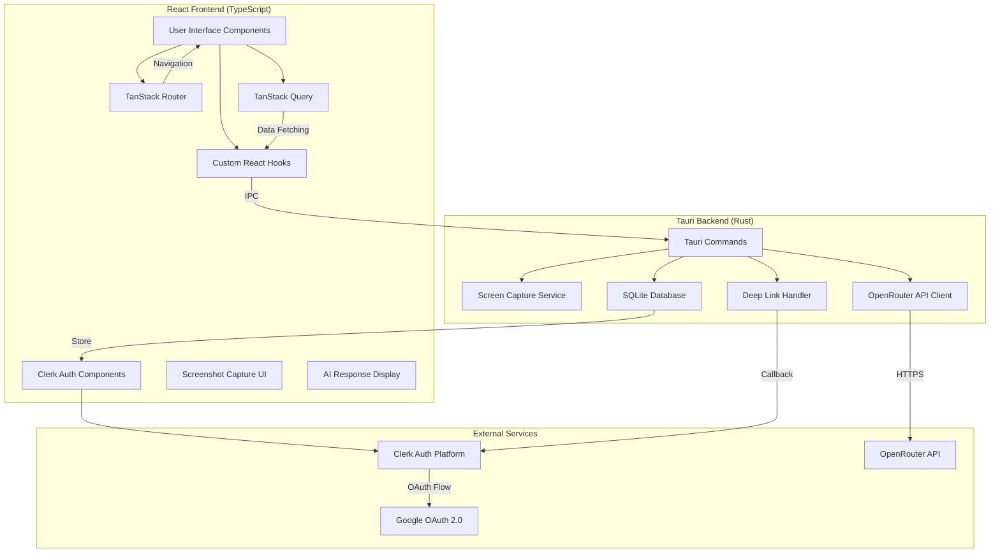
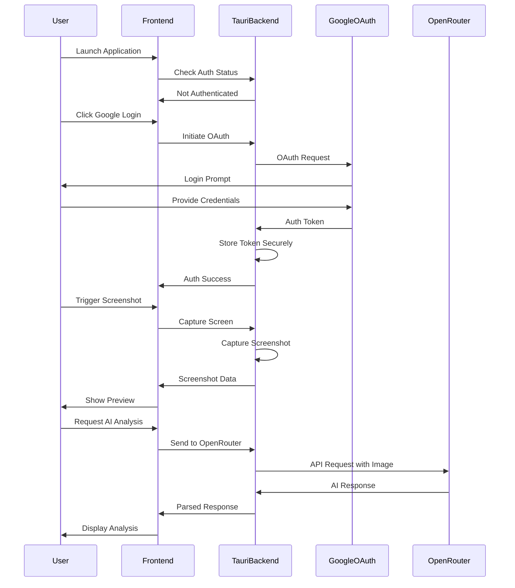

# Design Document: AI-Powered Interview Assistant

## Overview

The AI-Powered Interview Assistant is a desktop application built using Tauri 2.x, React 19, and TypeScript 5.8. The application architecture follows a clear separation between the Rust backend (Tauri) and the React frontend, communicating via Tauri's IPC (Inter-Process Communication) mechanism.

The system enables users to:
1. Authenticate via Clerk with Google OAuth integration
2. Capture screenshots of their screen (full screen or selected regions)
3. Send screenshots to OpenRouter API for AI analysis
4. Receive and display AI-generated explanations with markdown formatting
5. Manage sessions with local SQLite database storage

The design emphasizes security, cross-platform compatibility, privacy-first data handling, and a clean separation of concerns between UI, business logic, and system-level operations. The application uses modern React patterns with TanStack Router for navigation and TanStack Query for data fetching and caching.

## Architecture

### High-Level Architecture



### Component Interaction Flow



## Components and Interfaces

### Frontend Components (React/TypeScript)

#### 1. Application State Manager

**Purpose**: Centralized state management for authentication, screenshots, and AI responses.

**Interface**:
```typescript
interface AppState {
  isAuthenticated: boolean;
  user: UserInfo | null;
  currentScreenshot: Screenshot | null;
  aiResponse: AIResponse | null;
  isLoading: boolean;
  error: ErrorInfo | null;
}

interface UserInfo {
  email: string;
  name: string;
  picture: string;
}

interface Screenshot {
  data: string; // Base64 encoded image
  timestamp: number;
  width: number;
  height: number;
}

interface AIResponse {
  content: string;
  model: string;
  timestamp: number;
}

interface ErrorInfo {
  message: string;
  code: string;
  recoverable: boolean;
}
```

#### 2. Authentication Component

**Purpose**: Handle Google OAuth login flow and display authentication status.

**Interface**:
```typescript
interface AuthComponentProps {
  onLoginSuccess: (user: UserInfo) => void;
  onLogout: () => void;
}

// Tauri command invocations
async function initiateGoogleLogin(): Promise<UserInfo>
async function logout(): Promise<void>
async function checkAuthStatus(): Promise<boolean>
```

#### 3. Screenshot Capture Component

**Purpose**: Provide UI for triggering screenshot capture and displaying preview.

**Interface**:
```typescript
interface CaptureComponentProps {
  onScreenshotCaptured: (screenshot: Screenshot) => void;
  onError: (error: ErrorInfo) => void;
}

// Tauri command invocations
async function captureScreen(): Promise<Screenshot>
async function captureRegion(x: number, y: number, width: number, height: number): Promise<Screenshot>
```

#### 4. AI Response Display Component

**Purpose**: Display AI-generated analysis with proper formatting.

**Interface**:
```typescript
interface ResponseDisplayProps {
  screenshot: Screenshot;
  response: AIResponse;
  onNewCapture: () => void;
}

// Tauri command invocations
async function sendToOpenRouter(screenshot: Screenshot): Promise<AIResponse>
```

### Backend Components (Rust/Tauri)

#### 1. OAuth Service

**Purpose**: Handle Google OAuth 2.0 authentication flow.

**Interface**:
```rust
pub struct OAuthService {
    client_id: String,
    client_secret: String,
    redirect_uri: String,
}

impl OAuthService {
    pub fn new(client_id: String, client_secret: String) -> Self;
    pub async fn initiate_auth_flow(&self) -> Result<String, OAuthError>;
    pub async fn exchange_code_for_token(&self, code: String) -> Result<TokenResponse, OAuthError>;
    pub async fn refresh_token(&self, refresh_token: String) -> Result<TokenResponse, OAuthError>;
    pub async fn get_user_info(&self, access_token: String) -> Result<UserInfo, OAuthError>;
}

pub struct TokenResponse {
    pub access_token: String,
    pub refresh_token: Option<String>,
    pub expires_in: u64,
    pub token_type: String,
}
```

#### 2. Screen Capture Service

**Purpose**: Capture screenshots using platform-specific APIs.

**Interface**:
```rust
pub struct ScreenCaptureService;

impl ScreenCaptureService {
    pub fn new() -> Self;
    pub fn capture_full_screen(&self) -> Result<ImageData, CaptureError>;
    pub fn capture_region(&self, x: u32, y: u32, width: u32, height: u32) -> Result<ImageData, CaptureError>;
    pub fn check_permissions(&self) -> Result<bool, CaptureError>;
}

pub struct ImageData {
    pub data: Vec<u8>,
    pub width: u32,
    pub height: u32,
    pub format: ImageFormat,
}

pub enum ImageFormat {
    PNG,
    JPEG,
}
```

#### 3. OpenRouter API Client

**Purpose**: Communicate with OpenRouter API for AI analysis.

**Interface**:
```rust
pub struct OpenRouterClient {
    api_key: String,
    base_url: String,
    http_client: reqwest::Client,
}

impl OpenRouterClient {
    pub fn new(api_key: String) -> Self;
    pub async fn analyze_image(&self, image: ImageData, prompt: String) -> Result<AIResponse, APIError>;
    pub async fn list_available_models(&self) -> Result<Vec<ModelInfo>, APIError>;
}

pub struct AIResponse {
    pub content: String,
    pub model: String,
    pub usage: TokenUsage,
}

pub struct TokenUsage {
    pub prompt_tokens: u32,
    pub completion_tokens: u32,
    pub total_tokens: u32,
}

pub struct ModelInfo {
    pub id: String,
    pub name: String,
    pub description: String,
}
```

#### 4. Secure Storage Service

**Purpose**: Securely store authentication tokens using OS-level keychain/credential manager.

**Interface**:
```rust
pub struct SecureStorage;

impl SecureStorage {
    pub fn new() -> Self;
    pub fn store_token(&self, key: &str, token: &str) -> Result<(), StorageError>;
    pub fn retrieve_token(&self, key: &str) -> Result<Option<String>, StorageError>;
    pub fn delete_token(&self, key: &str) -> Result<(), StorageError>;
}
```

#### 5. Tauri Commands

**Purpose**: Expose backend functionality to frontend via IPC.

**Interface**:
```rust
#[tauri::command]
async fn initiate_google_login(state: State<'_, AppState>) -> Result<UserInfo, String>;

#[tauri::command]
async fn logout(state: State<'_, AppState>) -> Result<(), String>;

#[tauri::command]
async fn check_auth_status(state: State<'_, AppState>) -> Result<bool, String>;

#[tauri::command]
async fn capture_screen(state: State<'_, AppState>) -> Result<Screenshot, String>;

#[tauri::command]
async fn capture_region(x: u32, y: u32, width: u32, height: u32, state: State<'_, AppState>) -> Result<Screenshot, String>;

#[tauri::command]
async fn send_to_openrouter(screenshot: Screenshot, state: State<'_, AppState>) -> Result<AIResponse, String>;

#[tauri::command]
async fn get_available_models(state: State<'_, AppState>) -> Result<Vec<ModelInfo>, String>;
```

## Data Models

### Frontend Data Models (TypeScript)

```typescript
// User authentication data
interface UserInfo {
  email: string;
  name: string;
  picture: string;
}

// Screenshot data
interface Screenshot {
  data: string; // Base64 encoded image
  timestamp: number;
  width: number;
  height: number;
}

// AI response data
interface AIResponse {
  content: string;
  model: string;
  timestamp: number;
}

// Error information
interface ErrorInfo {
  message: string;
  code: string;
  recoverable: boolean;
}

// Application configuration
interface AppConfig {
  openRouterApiKey: string;
  googleClientId: string;
  defaultModel: string;
  screenshotFormat: 'png' | 'jpeg';
}
```

### Backend Data Models (Rust)

```rust
use serde::{Deserialize, Serialize};

#[derive(Debug, Clone, Serialize, Deserialize)]
pub struct UserInfo {
    pub email: String,
    pub name: String,
    pub picture: String,
}

#[derive(Debug, Clone, Serialize, Deserialize)]
pub struct Screenshot {
    pub data: String, // Base64 encoded
    pub timestamp: u64,
    pub width: u32,
    pub height: u32,
}

#[derive(Debug, Clone, Serialize, Deserialize)]
pub struct AIResponse {
    pub content: String,
    pub model: String,
    pub timestamp: u64,
}

#[derive(Debug, Clone, Serialize, Deserialize)]
pub struct TokenResponse {
    pub access_token: String,
    pub refresh_token: Option<String>,
    pub expires_in: u64,
    pub token_type: String,
}

#[derive(Debug, Clone, Serialize, Deserialize)]
pub struct OpenRouterRequest {
    pub model: String,
    pub messages: Vec<Message>,
}

#[derive(Debug, Clone, Serialize, Deserialize)]
pub struct Message {
    pub role: String,
    pub content: Vec<ContentPart>,
}

#[derive(Debug, Clone, Serialize, Deserialize)]
#[serde(tag = "type")]
pub enum ContentPart {
    #[serde(rename = "text")]
    Text { text: String },
    #[serde(rename = "image_url")]
    ImageUrl { image_url: ImageUrl },
}

#[derive(Debug, Clone, Serialize, Deserialize)]
pub struct ImageUrl {
    pub url: String, // data:image/png;base64,... format
}
```

## Correctness Properties

*A property is a characteristic or behavior that should hold true across all valid executions of a system—essentially, a formal statement about what the system should do. Properties serve as the bridge between human-readable specifications and machine-verifiable correctness guarantees.*


### Property 1: OAuth Flow Initiation
*For any* user interaction that triggers the Google login button, the application should invoke the OAuth service to initiate the authentication flow.
**Validates: Requirements 1.2**

### Property 2: Secure Token Storage
*For any* valid authentication token received from Google OAuth, the application should store it using the platform's secure storage mechanism (OS keychain/credential manager).
**Validates: Requirements 1.3, 6.1**

### Property 3: Authenticated Feature Access
*For any* user with a valid (non-expired) authentication token, all feature commands (screen capture, AI analysis) should be accessible without requiring re-authentication.
**Validates: Requirements 1.4**

### Property 4: Token Expiration Handling
*For any* authentication token that has expired, the application should transition to an unauthenticated state and prompt for re-authentication.
**Validates: Requirements 1.5**

### Property 5: Logout Token Cleanup
*For any* logout action, the application should clear the authentication token from secure storage and reset the application state to unauthenticated.
**Validates: Requirements 1.6**

### Property 6: Screen Capture Execution
*For any* screen capture trigger (button click or hotkey), the Screen_Capture_Service should return image data containing the captured screen or region.
**Validates: Requirements 2.2**

### Property 7: Screenshot Display with AI Response
*For any* captured screenshot and received AI response, the UI should display both the original screenshot and the AI analysis together in the same view.
**Validates: Requirements 2.3, 4.1, 4.2**

### Property 8: Error State and Recovery
*For any* operation failure (screenshot capture, API request, authentication), the application should set an error state with a descriptive message and provide a retry mechanism.
**Validates: Requirements 2.4, 3.5, 7.1, 7.2, 7.3, 7.4**

### Property 9: Post-Capture Action Availability
*For any* successfully captured screenshot, the application should enable the option to send it for AI analysis.
**Validates: Requirements 2.5**

### Property 10: API Request Formation
*For any* screenshot sent for AI analysis, the API request to OpenRouter should include the image data in base64 data URL format and use HTTPS protocol.
**Validates: Requirements 3.2, 3.3, 6.2**

### Property 11: API Response Parsing
*For any* valid response from OpenRouter API, the application should successfully parse and extract the AI-generated content into an AIResponse object.
**Validates: Requirements 3.4**

### Property 12: Loading State Display
*For any* asynchronous operation in progress (API request, authentication, screen capture), the application should display a loading indicator to the user.
**Validates: Requirements 3.6, 5.2**

### Property 13: Text Formatting Preservation
*For any* AI response containing formatted text (markdown, code blocks, lists), the rendered output should preserve the formatting structure.
**Validates: Requirements 4.3**

### Property 14: Post-Response Capture Availability
*For any* received AI response, the application should provide an enabled option to capture another screenshot.
**Validates: Requirements 4.5**

### Property 15: Error Message Display
*For any* error state in the application, the UI should display a user-friendly error message with actionable guidance.
**Validates: Requirements 5.3**

### Property 16: Screenshot Non-Persistence
*For any* screenshot captured during a session, after application restart without explicit save action, the screenshot should not be present in application state or storage.
**Validates: Requirements 6.3**

### Property 17: API Authentication Header
*For any* API request to OpenRouter, the request should include the API key in the authorization header.
**Validates: Requirements 6.4**

## Error Handling

### Error Categories

The application handles four main categories of errors:

1. **Authentication Errors**
   - OAuth flow failures
   - Token expiration
   - Invalid credentials
   - Network errors during authentication

2. **Screen Capture Errors**
   - Permission denied
   - Platform API failures
   - Invalid region specifications
   - System resource unavailability

3. **API Errors**
   - Network connectivity issues
   - OpenRouter API unavailability (5xx errors)
   - Invalid API responses
   - Rate limiting
   - Authentication failures (invalid API key)

4. **Application Errors**
   - State management errors
   - Data serialization/deserialization errors
   - Unexpected runtime errors

### Error Handling Strategy

```rust
// Error types hierarchy
#[derive(Debug, thiserror::Error)]
pub enum AppError {
    #[error("Authentication error: {0}")]
    Auth(#[from] OAuthError),
    
    #[error("Screen capture error: {0}")]
    Capture(#[from] CaptureError),
    
    #[error("API error: {0}")]
    Api(#[from] APIError),
    
    #[error("Storage error: {0}")]
    Storage(#[from] StorageError),
    
    #[error("Unexpected error: {0}")]
    Unexpected(String),
}

// Each error type includes recovery information
pub trait RecoverableError {
    fn is_recoverable(&self) -> bool;
    fn recovery_suggestion(&self) -> String;
}
```

### Error Recovery Patterns

1. **Automatic Retry**: Network errors and transient API failures
2. **User Prompt**: Permission errors and authentication failures
3. **Graceful Degradation**: Non-critical feature failures
4. **Error Reporting**: Unexpected errors with logging

### Frontend Error Handling

```typescript
interface ErrorInfo {
  message: string;
  code: string;
  recoverable: boolean;
  suggestion?: string;
}

// Error display component shows:
// - Clear error message
// - Recovery suggestion
// - Retry button (if recoverable)
// - Report issue link (if not recoverable)
```

## Testing Strategy

### Dual Testing Approach

The application requires both unit testing and property-based testing for comprehensive coverage:

**Unit Tests**: Focus on specific examples, edge cases, and integration points
- Specific OAuth flow scenarios (success, failure, token refresh)
- Screenshot capture edge cases (empty screen, invalid regions)
- API response parsing with specific response formats
- Error handling for specific error codes
- UI component rendering with specific props

**Property-Based Tests**: Verify universal properties across all inputs
- Authentication token storage and retrieval for any valid token
- Screenshot capture for any valid screen region
- API request formation for any screenshot data
- Error handling for any error type
- State transitions for any user action sequence

### Property-Based Testing Configuration

**Library Selection**:
- **Rust Backend**: Use `proptest` crate for property-based testing
- **TypeScript Frontend**: Use `fast-check` library for property-based testing

**Test Configuration**:
- Minimum 100 iterations per property test
- Each test tagged with feature name and property number
- Tag format: `// Feature: ai-interview-assistant, Property N: [property description]`

**Example Property Test (Rust)**:
```rust
#[cfg(test)]
mod tests {
    use super::*;
    use proptest::prelude::*;

    // Feature: ai-interview-assistant, Property 2: Secure Token Storage
    proptest! {
        #[test]
        fn test_secure_token_storage(token in "[a-zA-Z0-9]{32,128}") {
            let storage = SecureStorage::new();
            storage.store_token("test_key", &token).unwrap();
            let retrieved = storage.retrieve_token("test_key").unwrap();
            assert_eq!(retrieved, Some(token));
        }
    }
}
```

**Example Property Test (TypeScript)**:
```typescript
import fc from 'fast-check';

// Feature: ai-interview-assistant, Property 7: Screenshot Display with AI Response
test('displays screenshot and AI response together', () => {
  fc.assert(
    fc.property(
      fc.record({
        data: fc.base64String(),
        timestamp: fc.nat(),
        width: fc.nat(1, 4096),
        height: fc.nat(1, 4096),
      }),
      fc.string(),
      (screenshot, aiContent) => {
        const response = { content: aiContent, model: 'test', timestamp: Date.now() };
        const rendered = renderResponseDisplay(screenshot, response);
        return rendered.includes(screenshot.data) && rendered.includes(aiContent);
      }
    ),
    { numRuns: 100 }
  );
});
```

### Testing Coverage Requirements

1. **Backend (Rust)**:
   - Unit tests for each service (OAuth, ScreenCapture, APIClient, SecureStorage)
   - Property tests for all 17 correctness properties
   - Integration tests for Tauri command handlers
   - Mock external services (Google OAuth, OpenRouter API)

2. **Frontend (TypeScript/React)**:
   - Unit tests for each component
   - Property tests for state management and data flow
   - Integration tests for Tauri IPC communication
   - Mock Tauri commands for isolated testing

3. **End-to-End**:
   - Critical user flows (login → capture → analyze)
   - Error recovery scenarios
   - Cross-platform compatibility verification

### Test Organization

```
src-tauri/
  src/
    services/
      oauth.rs
      oauth_test.rs          # Unit + property tests
      screen_capture.rs
      screen_capture_test.rs # Unit + property tests
      api_client.rs
      api_client_test.rs     # Unit + property tests
      secure_storage.rs
      secure_storage_test.rs # Unit + property tests
    commands/
      mod.rs
      commands_test.rs       # Integration tests

src/
  components/
    Auth/
      Auth.tsx
      Auth.test.tsx          # Unit + property tests
    Capture/
      Capture.tsx
      Capture.test.tsx       # Unit + property tests
    Response/
      Response.tsx
      Response.test.tsx      # Unit + property tests
  state/
    appState.ts
    appState.test.ts         # Property tests
```

## Security Considerations

### Authentication Security

1. **OAuth Token Storage**:
   - Use OS-level secure storage (Keychain on macOS, Credential Manager on Windows, Secret Service on Linux)
   - Never store tokens in plain text or application preferences
   - Implement token refresh before expiration

2. **OAuth Flow**:
   - Use PKCE (Proof Key for Code Exchange) for enhanced security
   - Validate redirect URIs
   - Implement state parameter to prevent CSRF attacks

### API Security

1. **OpenRouter API Key**:
   - Store API key in secure storage, not in code or config files
   - Never expose API key in frontend code
   - Implement key rotation capability

2. **Network Security**:
   - All API requests over HTTPS
   - Implement certificate pinning for production
   - Validate SSL certificates

### Data Security

1. **Screenshot Handling**:
   - Screenshots stored in memory only during active session
   - Clear screenshot data on logout or app close
   - No automatic persistence to disk

2. **Logging**:
   - Never log authentication tokens
   - Never log API keys
   - Sanitize error messages before logging

## Performance Considerations

### Frontend Performance

1. **Screenshot Preview**:
   - Compress large screenshots before display
   - Use thumbnail generation for preview
   - Lazy load full-resolution images

2. **UI Responsiveness**:
   - Debounce user inputs
   - Use React.memo for expensive components
   - Implement virtual scrolling for long AI responses

### Backend Performance

1. **Screen Capture**:
   - Optimize capture region to reduce data size
   - Use efficient image encoding (PNG for screenshots)
   - Implement capture throttling to prevent abuse

2. **API Communication**:
   - Implement request queuing
   - Add timeout handling (30s default)
   - Cache model information

### Resource Management

1. **Memory**:
   - Clear screenshot data after AI response received
   - Implement maximum screenshot size limits
   - Monitor memory usage in long-running sessions

2. **Network**:
   - Implement retry with exponential backoff
   - Add request cancellation capability
   - Monitor API rate limits

## Deployment Considerations

### Configuration Management

```rust
// Configuration loaded from environment or config file
pub struct AppConfig {
    pub google_client_id: String,
    pub google_client_secret: String,
    pub openrouter_api_key: String,
    pub openrouter_base_url: String,
    pub default_model: String,
    pub max_screenshot_size: u32,
    pub api_timeout_seconds: u64,
}
```

### Platform-Specific Considerations

1. **macOS**:
   - Request screen recording permission
   - Use macOS Keychain for secure storage
   - Handle retina display scaling

2. **Windows**:
   - Request necessary permissions
   - Use Windows Credential Manager
   - Handle multi-monitor setups

3. **Linux**:
   - Support multiple desktop environments (GNOME, KDE, etc.)
   - Use Secret Service API for secure storage
   - Handle Wayland vs X11 differences

### Build and Distribution

1. **Tauri Configuration**:
   - Configure app identifier and version
   - Set up code signing for each platform
   - Configure auto-update mechanism

2. **Environment Variables**:
   - Google OAuth credentials
   - OpenRouter API key
   - Build-time configuration

3. **Release Process**:
   - Automated builds for all platforms
   - Code signing and notarization
   - Update server configuration
